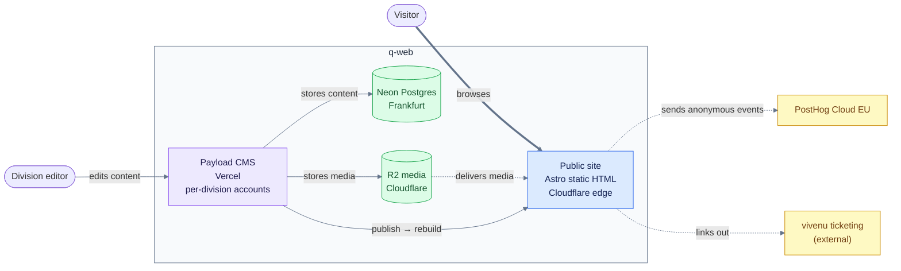

# 3 · Context and scope

<!-- arc42 section 3: C4 Context level, Mermaid (renders on GitHub). -->

## System context

_Visitors only browse the public site; HTML comes from Cloudflare's edge and media from R2. The CMS and database sit behind the build step, so a CMS or database outage never takes the site down. Dotted edges are external or asynchronous; analytics events reach PostHog through the site's own Worker route, cookieless per ADR-0003._

## Scope notes

- **The site is static.** No runtime backend, no forms with server logic (as of the migration; form handling is an owed ADR, see [section 9](09-architecture-decisions.md)). Ticketing is fully external (vivenu).
- **Editors never touch the repo.** All content flows through Payload; production builds read only published Payload content, and no real content lives in git. Maintainers and agents may propose **draft packages** via `POST /api/content-sync` ([content-sync](../dev/content-sync.md)); only approvers Publish. Publish schedules a Workers Builds rebuild ([section 6](06-runtime.md), [go-live](../dev/go-live.md)).
- **Analytics is cookieless by decision.** [ADR-0003](../decisions/0003-posthog-cookieless-analytics.md) picks PostHog Cloud EU with no cookies and no consent banner. The client is shipped, gated to production hostnames, and ingests through the site's own `/qm` Worker route so no request reaches a third-party host ([analytics](../dev/analytics.md)).
- **Out of scope:** the conference platform (attendee app, partner platform, organizer tools) lives in [q-app](https://github.com/Q-Summit/q-app), a separate repo and stack.
