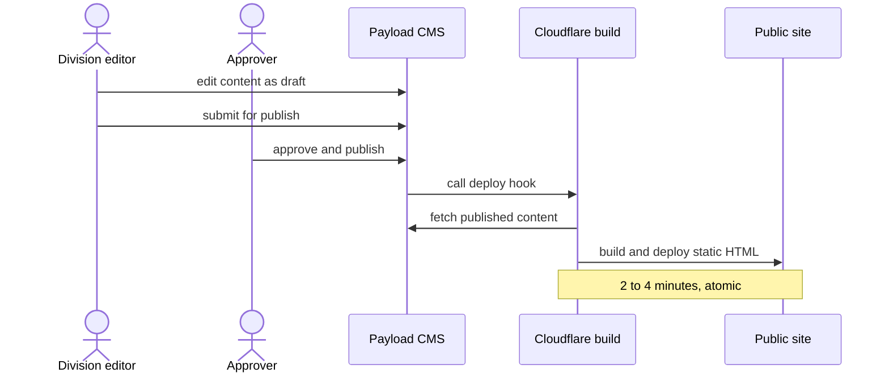

# 6 · Runtime

<!-- arc42 section 6: durable behavior, sequence/flow diagrams. -->

## Publish to live

The flagship flow: how an editor's change reaches the public site.

_Drafts are invisible until approved; only a publish event triggers the rebuild, and the live site changes only when a build succeeds end to end._

- Rollback: redeploy any of the last 100 builds in one click (see [section 7](07-deployment.md)).
- The hook fires only on transitions to published state, debounced so a burst of edits triggers one rebuild.
