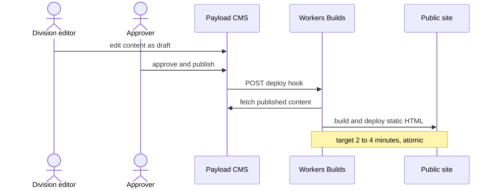

# 6 · Runtime

<!-- arc42 section 6: durable behavior, sequence/flow diagrams. -->

## Publish to live

**Today:** Production deploys through Cloudflare Workers Builds ([ADR-0004](../decisions/0004-cloudflare-workers-builds-deploy.md)). Merges to `main` build `apps/web` atomically. A Head/Admin **live-site change** in Payload (publish, unpublish, restore, live delete) POSTs `CLOUDFLARE_DEPLOY_HOOK_URL` (`apps/cms/src/lib/trigger-deploy.ts`). Cloudflare dedupes bursts while a build is queued. Manual override: **Rebuild site** (`.github/workflows/site-rebuild.yml`).

**Content propose:** `POST /api/content-sync` upserts **drafts only**; it never publishes and never imports `trigger-deploy`. Procedure: [`../dev/content-sync.md`](../dev/content-sync.md).

_Drafts stay invisible until publish. Rebuilds also fire on unpublish, restore, and live deletes. content-sync never rebuilds._

### What refreshes on Publish / redeploy

| Layer | Behavior |
| --- | --- |
| **HTML** | New Assets deploy; `Cache-Control: max-age=0, must-revalidate` (`_headers`) |
| **`/_astro/*`** | Content-hashed + `immutable` |
| **`/media/*`** | Worker Cache API keyed by R2 etag; browser TTL 1 day (no `immutable`) |
| **`/qm/*`** | Never cached; the Worker forwards each analytics request to PostHog EU |
| **HLS `.m3u8`** | `max-age=3600` |

Media uploads alone do not rebuild; Publish (or **Rebuild site**) updates pages that reference new files.

Hook details: draft-only saves (`?draft=true` / content-sync) skip; prior live status is stashed from the main table before write (Payload `previousDoc` is the latest version, not the live row). Unset hook URL skips locally; Vercel production requires it at boot.

- Rollback: previous Workers Builds deployment, or `git revert` on `main` ([section 7](07-deployment.md)).
