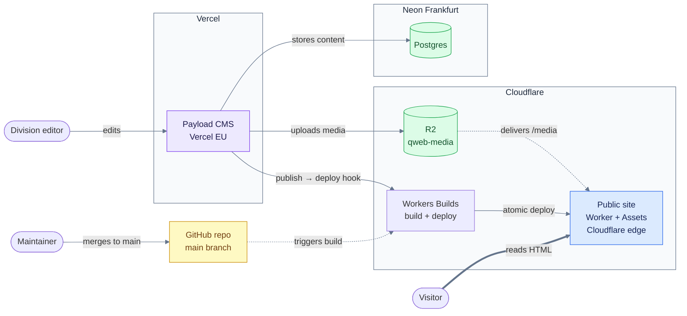

# 7 · Deployment

<!-- arc42 section 7: infrastructure and deployment topology. -->

Set by [ADR-0001](../decisions/0001-astro-static-site.md), [ADR-0002](../decisions/0002-payload-cms-on-vercel-neon.md), [ADR-0003](../decisions/0003-posthog-cookieless-analytics.md), and the deploy model in [ADR-0004](../decisions/0004-cloudflare-workers-builds-deploy.md). Command-level setup: [`../dev/local-development.md`](../dev/local-development.md), [`../dev/content-sync.md`](../dev/content-sync.md), and [`../dev/go-live.md`](../dev/go-live.md).

## Topology

| What | Where | Region |
| --- | --- | --- |
| Static site + `/media/*` Worker | Cloudflare Workers + Assets | Global edge |
| Media objects | Cloudflare R2 bucket `qweb-media` | Global edge |
| Payload CMS | Vercel | EU function region |
| Postgres | Neon | Frankfurt |
| Analytics (cookieless client shipped, proxied via the site Worker) | PostHog Cloud EU | EU |

_A merge to main triggers Workers Builds, which builds `apps/web` and deploys atomically to the edge. Media comes from R2 through the Worker; the CMS writes to Neon and R2. An approver Publish also POSTs the Workers Builds deploy hook (Cloudflare dedupes bursts); a CMS outage still cannot take the live static site down._

## Site Worker contract

Durable facts only (setup steps: [`../dev/go-live.md`](../dev/go-live.md)):

- `apps/web/wrangler.jsonc`: assets from `./dist`, `MEDIA` → `qweb-media`, `run_worker_first: ["/media/*", "/qm/*"]` (R2 media and the PostHog ingestion proxy)
- `not_found_handling: "404-page"` serves `dist/404.html` (built from `src/pages/404.astro`) on unmatched routes
- Handler: `apps/web/worker/index.ts`
- `apps/web/public/.assetsignore` excludes `media` from asset uploads

## CMS migrations

Summary only; steps live in [`../dev/go-live.md`](../dev/go-live.md). Local schema **push** against docker Postgres. Production: committed `apps/cms/src/migrations/`; Vercel runs `migrate` before `next build`. Never push in production.

## Release and rollback

- **Site:** merge to `main` or approver live-site change (publish / unpublish / restore) → Workers Builds ([section 6](06-runtime.md)). Manual override: **Rebuild site**.
- **Site rollback:** restore a previous Workers Builds deployment, or `git revert` on `main` and let the next build redeploy.
- **CMS:** deploys from `main` via Vercel once the project is connected. Neon supports point-in-time restore.

## Environments

| Environment | Site content | CMS DB | Media |
| --- | --- | --- | --- |
| Local JSON | committed fake fixture | unused | optional gitignored `public/media` (same keys as R2) |
| Local full | `CONTENT_SOURCE=cms` + local Payload | docker Postgres | MinIO + `pnpm r2:sync` into wrangler R2 |
| Content propose | drafts via `POST /api/content-sync` | target CMS DB (local or Neon through CMS only) | create-if-missing via `POST /api/content-sync/media`, then filename lookup; no deploy |
| Production | `CONTENT_SOURCE=cms` at build | Neon | real R2 |
